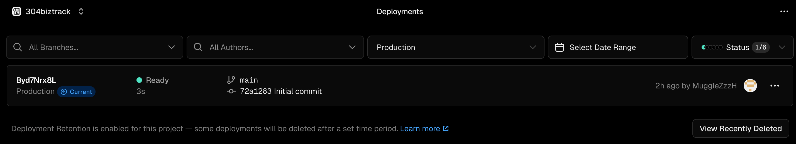
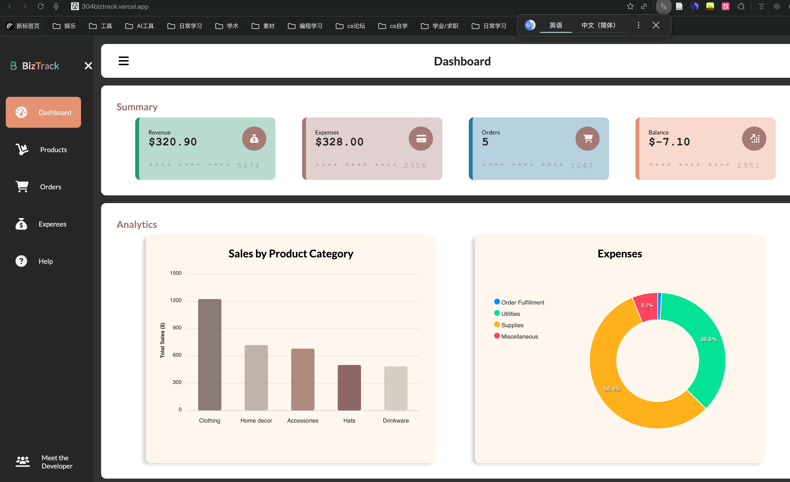
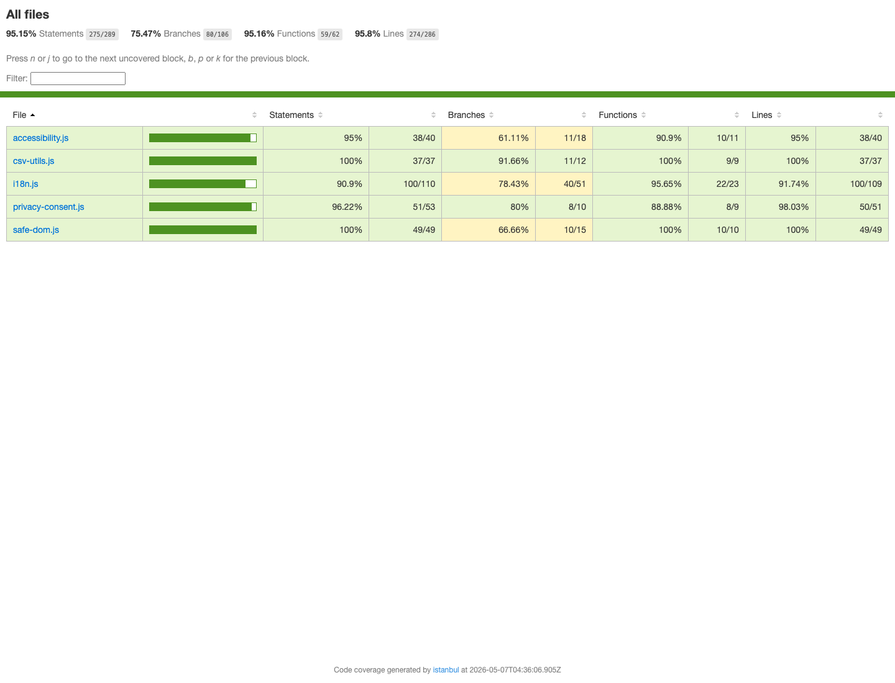
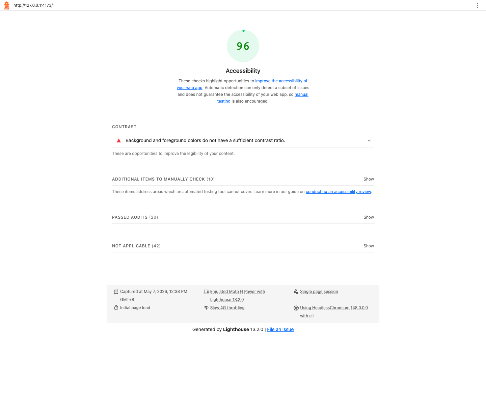
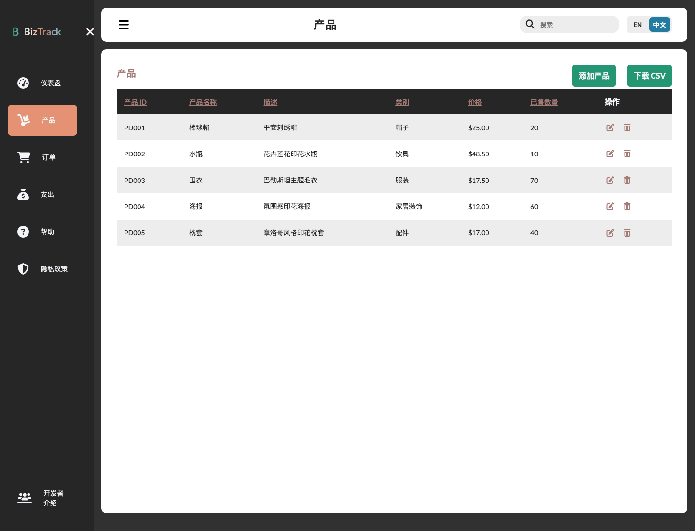
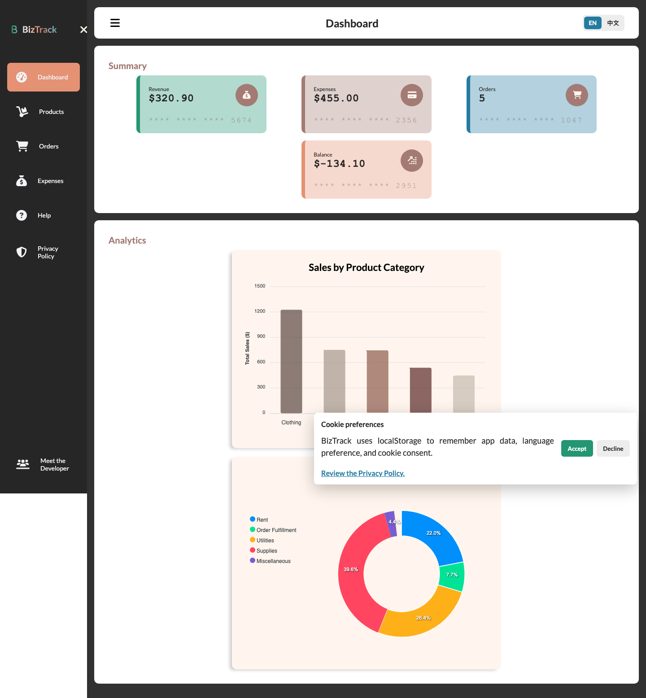
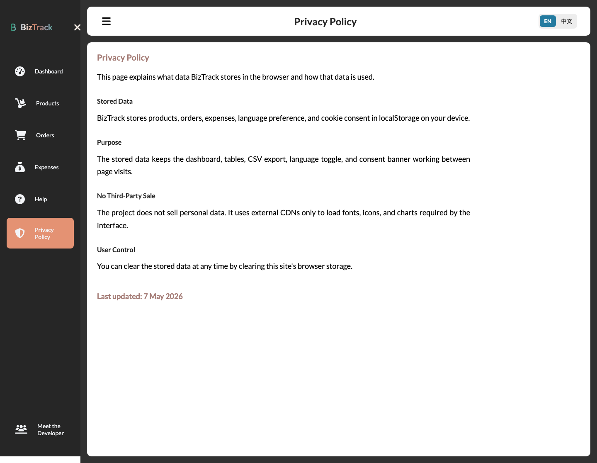

# BizTrack Deployment Evidence

## Production Deployment

- Platform: Vercel
- Production URL: https://304biztrack.vercel.app/
- Repository URL: https://github.com/MuggleZzzH/304biztrack
- Verification date: 2026-05-07, Asia/Shanghai

Submission note: this folder keeps deployment evidence together for the repository. When preparing the final coursework ZIP, check whether the required `live-url.txt` and `github-url.txt` files must be copied from this folder to the ZIP root.

## Visual Evidence

### Figure 1. Vercel Production Deployment Ready State

Save the Vercel dashboard screenshot as:

```text
deployment/evidence/vercel-dashboard-ready.png
```

Then use this figure in the report:



Caption: Figure 1. Vercel Deployments dashboard showing the BizTrack production deployment in Ready state.

### Figure 2. Public Production Site



Caption: Figure 2. BizTrack production homepage loaded from the public Vercel URL in a browser address bar.

### Figure 3. Istanbul Coverage Report



Caption: Figure 3. Istanbul coverage report generated by `npm run coverage`, showing 95.8% line coverage for the tested BizTrack utility and baseline modules.

Badge file for README/report use:

```text
deployment/evidence/coverage-badge.svg
```

### Figure 4. Lighthouse Accessibility Report



Caption: Figure 4. Lighthouse Accessibility report for the current BizTrack build, showing an Accessibility score of 96.

Machine-readable Lighthouse output:

```text
deployment/evidence/lighthouse-accessibility.json
deployment/evidence/lighthouse-accessibility.html
```

### Figure 5. Internationalization Toggle



Caption: Figure 5. BizTrack Products page displayed in Chinese, demonstrating the English/Chinese language toggle.

Additional i18n evidence:

```text
deployment/evidence/i18n-chinese-help.png
```

### Figure 6. Cookie Consent Banner



Caption: Figure 6. Cookie consent banner explaining localStorage use and offering Accept and Decline choices.

### Figure 7. Privacy Policy Page



Caption: Figure 7. Dedicated Privacy Policy page explaining localStorage data, purpose, third-party use, and user control.

## Online Smoke Test

The deployed application was checked from the public Vercel URL. The main HTML pages and static assets returned HTTP 200 responses from Vercel.

| URL | Result |
| --- | --- |
| https://304biztrack.vercel.app/ | 200 OK |
| https://304biztrack.vercel.app/products.html | 200 OK |
| https://304biztrack.vercel.app/orders.html | 200 OK |
| https://304biztrack.vercel.app/finances.html | 200 OK |
| https://304biztrack.vercel.app/styles.css | 200 OK |
| https://304biztrack.vercel.app/products.js | 200 OK |

Representative response headers observed during verification:

```text
HTTP/2 200
server: Vercel
content-type: text/html; charset=utf-8
x-vercel-cache: HIT
```

Browser-level verification was also performed against the public Vercel URL. The checked pages loaded with HTTP 200 responses and no browser console errors or warnings were observed.

| Page | Screenshot |
| --- | --- |
| Production homepage with browser address bar | `deployment/evidence/vercel-live-browser.png` |
| Production homepage, desktop viewport | `deployment/evidence/vercel-home.png` |
| Products page, desktop viewport | `deployment/evidence/vercel-products.png` |
| Products page, mobile viewport | `deployment/evidence/vercel-products-mobile.png` |
| Istanbul coverage report | `deployment/evidence/coverage-report.png` |
| Istanbul coverage badge | `deployment/evidence/coverage-badge.svg` |
| Lighthouse Accessibility report | `deployment/evidence/lighthouse-accessibility.png` |
| Chinese language toggle evidence | `deployment/evidence/i18n-chinese-products.png` |
| Chinese help-page translation evidence | `deployment/evidence/i18n-chinese-help.png` |
| Cookie banner evidence | `deployment/evidence/cookie-banner.png` |
| Privacy Policy page evidence | `deployment/evidence/privacy-policy.png` |

## Manual Verification Checklist

- Open the production homepage.
- Navigate to Products, Orders, Expenses, Help, and About.
- Confirm the browser console has no visible JavaScript errors.
- Add, edit, and delete a Product record.
- Add, edit, and delete an Order record.
- Add and delete an Expense record.
- Export Products, Orders, and Expenses as CSV.
- Capture screenshots of the Vercel project dashboard showing the Production deployment in Ready state.
- For final submission, capture a Vercel or monitoring screenshot that clearly shows 7+ consecutive days of production uptime.
- Capture screenshots of the deployed application URL opened in the browser.
- After pushing these baseline changes and waiting for Vercel deployment, rerun Lighthouse against the production URL and replace local Lighthouse evidence if required by the marker.

## Report Caption Suggestions

Figure X. BizTrack production deployment on Vercel showing the deployed site at https://304biztrack.vercel.app/.

Figure X. Vercel deployment dashboard showing the Production deployment status as Ready.

Figure X. Public BizTrack Products page loaded from the Vercel production URL.

Figure X. Istanbul coverage report showing 95.8% line coverage after running the Vitest test suite with Istanbul coverage.

Figure X. Lighthouse Accessibility report showing an Accessibility score of 96 for the current BizTrack build.

Figure X. BizTrack Products page displayed in Chinese, demonstrating the English/Chinese internationalization toggle.

Figure X. Cookie consent banner showing the app's localStorage notice and Accept/Decline controls.

Figure X. BizTrack Privacy Policy page documenting stored data, purpose, third-party use, and user control.
